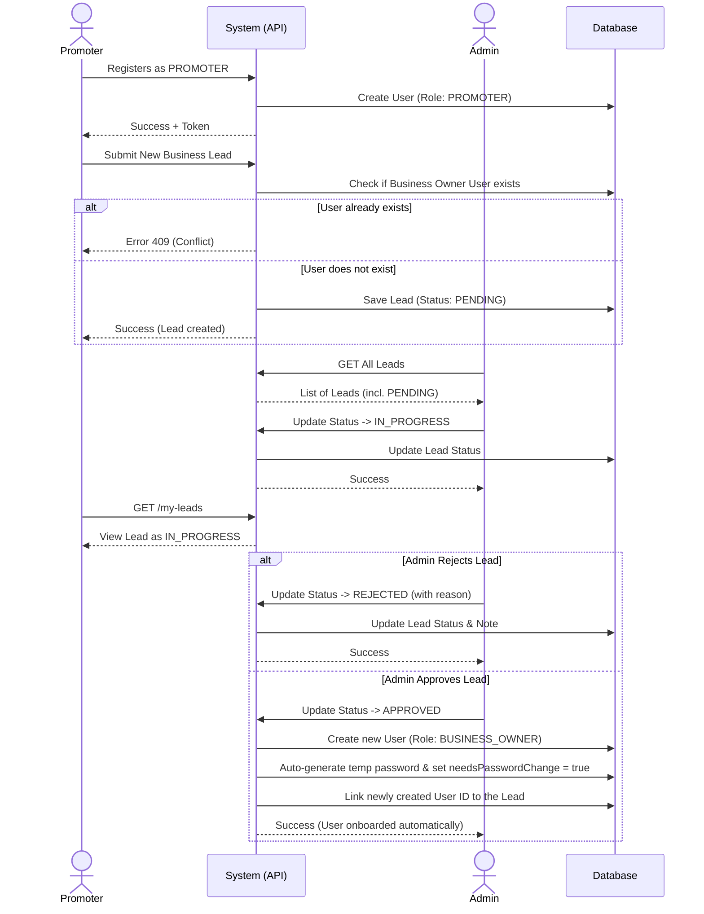

# Lead Module & Promoter Journey

This document outlines the complete workflow for the **Promoter and Lead Management** lifecycle in our system. It describes how a promoter submits a lead, how the admin manages its status, and what happens when a lead is approved or rejected.

## Flow Visualization (Mermaid)

Below is a Sequence Diagram mapping out the exact flow tested in our E2E journey (`promoter-journey.e2e.spec.ts`):

## E2E Test Coverage
Our E2E test suite covers:
1. Promoter successfully registering.
2. Promoter submitting a business lead.
3. Admin fetching all leads.
4. Admin moving the lead to `IN_PROGRESS`.
5. Promoter fetching their own leads to verify the status.
6. Admin updating the lead status to `REJECTED` (with internal notes).
*(Approvals and user auto-generation are handled in service logic and covered through unit/integration layers).*
